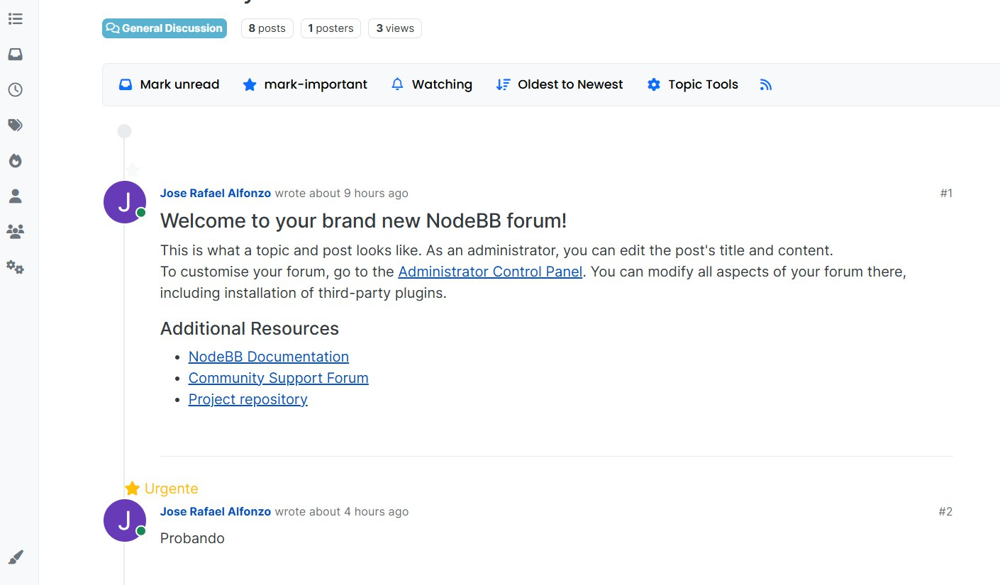

### CI3715 - Ingeniería de Software I

# Proyecto 2C

## Guía detallada sobre las caracteristicas implementadas 

#### Integrantes de QuantumDevs 

- Jhonaiker Blanco 18-10784
- Eliezer Cario 18-10605
- Fredthery Castro 18-10783
- Jose Alfonzo 17-10012
- Angel Rodriguez 15-11669

### Resumen
Se trabajo en la caracteristica de la Priorizacion de preguntas,es decir
permitir a los estudiantes marcar una pregunta como urgente para llamar la atención del profesor.Para esto se subdividio en las siguientes caracteristicas el trabajo:

- **Desatacar Visualmente Preguntas Urgentes**.

Esta caracteristica aborda la implementación de un indicador visual para resaltar mensajes marcados como "urgentes" en los temas de discusión. Se ha añadido un nuevo bloque de código en la plantilla nodebb-theme-quantum-devs/templates/topic.tpl que muestra un ícono de estrella en color amarillo junto al mensaje en caso de que esté marcado como urgente (isUrgent = true). En caso contrario, la estrella se muestra en blanco. Además, se añadió un nuevo estilo en topic.scss para personalizar el color y tamaño del ícono de estrella en mensajes urgentes.

Este cambio permite a los usuarios e instructores identificar fácilmente los mensajes prioritarios, destacándolos visualmente en la interfaz del foro

-**Crear la marca importante del boton**

En esta caracteristica, se implementará un botón o enlace visible junto a cada pregunta que permita a los usuarios marcarla como urgente. Esto puede ser un icono de estrella.

- **Agregar test a creacion de posts**.

Se modificaron los archivos public/openapi/components/schemas/PostObject.yaml, public/openapi/read/topic/topic_id.yaml y public/openapi/write/posts/pid.yaml para manejar el valor isUrgent (el booleano que determina si un post es urgente o no) de forma adecuada

Se agregó un Boolean() en el archivo src/posts/create.js para asegurarse de que isUrgent es un booleano

Se agregaron parametros isUrgent a los posts de prueba en el archivo test/api.js para testear los posts de manera adecuada

Se modificaron los tests para aceptar los "false" y "true" como booleanos, esto no es para nada ideal pero no pudimos descifrar por qué el sistema convertía estos booleanos a string ya que hicimos varias conversiones para verificar que estos sean booleanos 

- **Internalizacion del boton**.

Para esta parte se agrego internalización de boton mark important y arreglo de scss para el mismo boton

- **Modificar formulario registro**
En esta parte, los usuarios deberán seleccionar su rol académico: Profesor o Alumno al momento de registrarse. Para implementar esta característica, se ha agregado un nuevo bloque de código en la plantilla de registro.

**Vista de los cambios realizados**

Para la primera seccion de priorizacion de preguntas y marcarlas como urgentes, basta con que ingresemos en un foro y publiquemos un mensaje, en este momento se marcara como urgente el comentario tal y como se ve en la siguiente imagen.

Para la siguiente seccion del formulario de registro, luego de ingresar tu suario y contrasena normalmente, tienes que agregar tu rol academico, en este caso, profesor o alumno.A continuacion se muestra como queda

